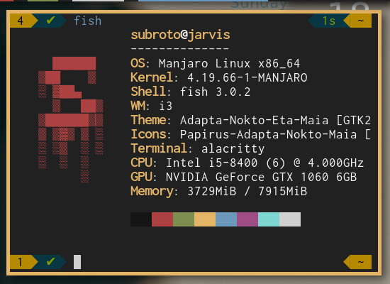

# Shub's Dotfiles

	
	 
	<i>Custom Rice - <b>Heart on Flames</b></i>

I have been troubling to setup Linux for a long time now. But recently Reddit has helped me a lot
and the subreddit [r/unixporn](https://www.reddit.com/r/unixporn/) has inspired me to upgrade my
Linux environment. I still have a long way to go for my setup to be complete, and totally fitting for
my personal use.

> This repo contains custom **fish-shell**, **i3** and many other confs for my persolnal setup
> I have totally shifted to `fish` shell, and all my basic configs will be based on `fish`.

## Important Tools required:

> After Installing Manjaro, with i3wm as windows manager, some important tools
> are required for my setup (Arch is not used from scratch, as there are many setups and confs
> that manjaro handles by default).

* [Polybar](https://github.com/polybar/polybar) - replaced the default `i3bar` with polybar for better customizations
* [Alacritty](https://github.com/jwilm/alacritty) - I was using `URxvt` for starters for my
	Terminal, it's quite light weight, but lacks support for dynamic glyph widths, where alacritty is great. Also Alacritty is GPU accelerated, which makes it the future of Terminals.
* [Fish Shell](https://github.com/fish-shell/fish-shell) - Modern shell for development.
	- [Oh My Fish](https://github.com/oh-my-fish/oh-my-fish) - For some default themes and extra
		features. I am using [Budspencer](https://github.com/oh-my-fish/theme-budspencer) as
		my terminal theme.
	- [Fuzzy Search](https://github.com/junegunn/fzf) - This is required for a good fuzzy search
		for the `history`. Can be used for other stuffs as well.
* [Rofi](https://github.com/davatorium/rofi) - Program runner
* [Nerd Fonts](https://github.com/ryanoasis/nerd-fonts) - Patched fonts to get handled by
	powerline shells. I am using a mix of `FuraCode` and `Inconsolata`.
* [Xresouces-Themes](https://github.com/logico-dev/Xresources-themes) - Privides some managed
	set of theme colors, from which I am currently using `iterm-afterglow`.

## Some useful commands

* Clean Font Cache - `fc-cache -vf ~/.fonts/`

## To Dos:

* Setup Git for my personal projects.
	- Basically I need to understand how to set up my git template.
	- Need to understand what ctags does.

